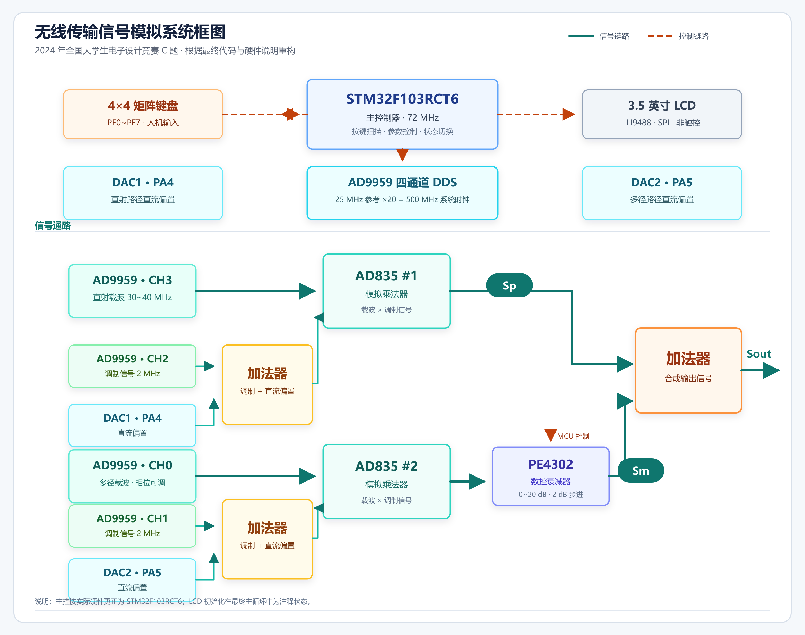

# 无线传输信号模拟系统

2024 年全国大学生电子设计竞赛 C 题作品。本项目以 STM32F103RCT6 为控制核心，结合 AD9959 多通道 DDS、两片 AD835 模拟乘法器、PE4302 数控衰减器和 STM32 内部 DAC，构建双路载波 AM 调制与多径信号模拟系统。

系统通过 AD9959 产生载波和调制信号，使用 AD835 完成模拟乘法调制；DAC 输出直流偏置，经加法器叠加到调制信号上；信号再经过幅度、相位和时延调节，最终由加法器完成多径信号合成。4x4 矩阵键盘用于切换工作状态并实时调整参数。



## 项目简介

本作品面向无线传输环境中的多径效应模拟，可用于演示载波调制、信号幅度调节、相位调节、时延模拟以及多路信号合成。

系统采用两路结构，每路包含载波信号、调制信号、模拟乘法器、直流偏置和幅度调节单元。两路信号具有独立参数控制能力，最终通过加法器合成，模拟接收端叠加后的多径信号。

## 主要功能

- 使用 AD9959 四通道 DDS 产生双路载波和双路调制信号。
- 使用两片 AD835 完成模拟乘法，实现双路载波 AM 调制。
- 使用 STM32 内部 DAC 输出直流信号，经加法器为调制信号提供偏置。
- 使用 PE4302 实现数字步进衰减，调节支路信号幅度。
- 通过 AD9959 的频率和相位控制实现多径时延与相位差模拟。
- 使用末级加法器完成多路信号合成。
- 使用 4x4 矩阵键盘完成复位、调制深度、载波频率、衰减量和相位等参数控制。
- 支持 3.5 英寸 320x480 ILI9488 SPI 液晶显示模块，该屏幕为非触摸屏；当前主程序默认关闭 LCD 初始化，核心功能可由矩阵键盘独立完成。

## 系统原理

### 1. 信号产生

AD9959 的四个通道分别用于两路载波和两路调制信号。主程序默认配置如下：

| AD9959 通道 | 默认频率 | 默认幅度 | 用途 |
| --- | ---: | ---: | --- |
| CH0 | 30 MHz | 满幅 | 第一路载波 |
| CH1 | 2 MHz | 约 150 mV | 第一路调制信号 |
| CH2 | 2 MHz | 约 150 mV | 第二路调制信号 |
| CH3 | 30 MHz | 满幅 | 第二路载波 |

程序支持对调制深度和载波频率进行步进调节，其中载波频率可在 30 MHz 至 40 MHz 范围内以 1 MHz 为步进调整。

### 2. 直流偏置与 AM 调制

STM32F103RCT6 的内部 DAC 使用 PA4 和 PA5 输出两路直流信号。DAC 输出通过加法器叠加到调制信号上，使调制信号获得可控直流分量，再送入 AD835 与载波信号相乘。

AD835 作为模拟乘法器，完成载波与调制信号的乘法运算，形成 AM 调制信号。两路调制链路使用两片 AD835，实现双路载波 AM 调制。

### 3. 幅度、相位与时延调节

PE4302 为 6 位数控衰减器，控制引脚连接至 STM32 的 PE0 至 PE5，可实现 0 dB 至 31.5 dB、0.5 dB 步进的衰减控制。当前交互程序以 2 dB 为步进，在 0 dB 至 20 dB 范围内调节支路衰减量。

AD9959 的相位控制字用于调节通道初相位。程序通过改变 CH0 的相位，实现多径相位差和等效时延模拟。频率控制字用于调节载波频率，频率变化与相位控制共同改变两路信号的相对关系。

### 4. 信号合成

两路经过载波调制和参数调节后的信号进入末级加法器，完成多径信号合成。加法器输出可作为模拟接收端的多径叠加信号，用于后续观测和分析。

## 硬件组成

| 模块 | 型号或规格 | 作用 |
| --- | --- | --- |
| 主控制器 | STM32F103RCT6 | 系统控制、参数计算、DAC 输出和外设管理 |
| DDS 信号源 | AD9959 | 产生双路载波和双路调制信号 |
| 模拟乘法器 | AD835 x 2 | 完成两路载波 AM 调制 |
| 数控衰减器 | PE4302 | 调节支路信号幅度 |
| 直流偏置 | STM32 DAC1/DAC2 | 为调制信号提供可调直流分量 |
| 人机输入 | 4x4 矩阵键盘 | 切换状态和调节系统参数 |
| 显示模块 | 3.5 英寸 ILI9488 SPI LCD | 非触摸显示模块，代码已提供驱动支持 |

## 键盘控制

下表中的按键编号为 `Button4_4_Scan()` 返回的逻辑键值。

| 按键 | 功能 |
| --- | --- |
| 1 | 切换 CH2 输出状态，用于载波/调制信号开关控制 |
| 2 | 增加 CH3 幅度控制档位，同时调整 DAC1 偏置 |
| 3 | 减小 CH3 幅度控制档位，同时调整 DAC1 偏置 |
| 4 | 恢复默认参数并重新初始化 AD9959 输出 |
| 5 | 减小调制系数 |
| 6 | 增大调制系数 |
| 7 | 载波频率减小 1 MHz |
| 8 | 载波频率增大 1 MHz |
| 9 | 切换到下一组多径时延相位 |
| 10 | 切换到上一组多径时延相位 |
| 11 | PE4302 衰减量增加 2 dB |
| 12 | PE4302 衰减量减小 2 dB |
| 13 | CH0 初相位增加 30 度 |
| 14 | CH0 初相位减小 30 度 |
| 15、16 | 保留 |

## 软件结构

```text
24-C-MDKARM/
├─ CORE/                STM32 内核和启动文件
├─ HARDWARE/            外设驱动
│  ├─ AD9959/           AD9959 DDS 驱动
│  ├─ PE4302/           PE4302 数控衰减器驱动
│  ├─ dac/              STM32 DAC 驱动
│  ├─ BUTTON4_4/        4x4 矩阵键盘驱动
│  ├─ LCD/              ILI9488 LCD 驱动
│  ├─ SPI/              SPI 接口代码
│  ├─ IIC/              I2C 接口代码
│  ├─ 24CXX/            EEPROM 驱动
│  ├─ LED/              LED 驱动
│  └─ KEY/              按键相关代码
├─ SYSTEM/              延时、系统初始化和串口代码
├─ STM32F10x_FWLib/     STM32 标准外设库
├─ USER/                主程序、GUI、测试代码和 Keil 工程
├─ OBJ/                 编译输出目录
└─ docs/                项目说明图片
```

核心程序位于 `USER/main.c`，参数步进和键盘交互逻辑位于 `HARDWARE/anjian/anjian.c`。

## 编译与下载

1. 使用 Keil uVision 5 打开 `USER/module1.uvprojx`。
2. 确认目标芯片为 STM32F103RC，系统主频为 72 MHz。
3. 重新编译工程。
4. 使用 ST-Link、J-Link 或串口下载工具将程序烧录到 STM32F103RCT6。
5. 上电后，STM32 初始化键盘、PE4302、DAC 和 AD9959，随后进入矩阵键盘扫描循环。

编译生成的可烧录文件位于 `OBJ/module1.hex`。

## 实现说明

- AD9959 使用 SPI 方式配置，四通道输出经过 `IO_Update()` 后同步生效。
- 直流偏置通过“DAC 输出加调制信号”的方式加入调制链路。
- 多径参数调理由矩阵键盘完成，不需要触摸屏即可运行。
- 末级信号合成为加法器结构，系统中不包含合路器。
- 两路信号需要通过频率、相位和衰减参数配合，才能获得稳定的合成效果。

## 适用场景

本项目可用于电子设计竞赛训练、无线通信原理实验、AM 调制与多径效应演示，以及 STM32 外设驱动和 DDS 信号源开发参考。
